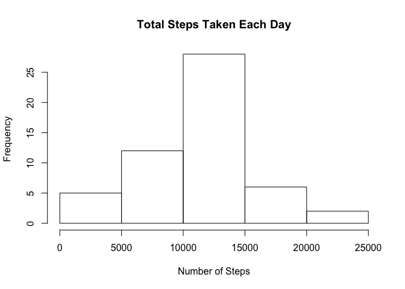
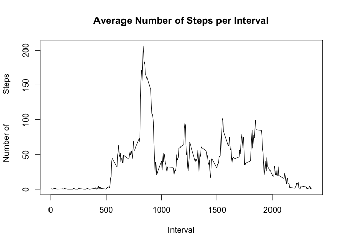
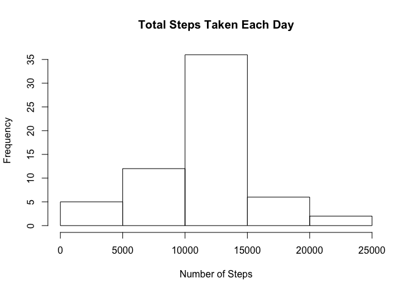
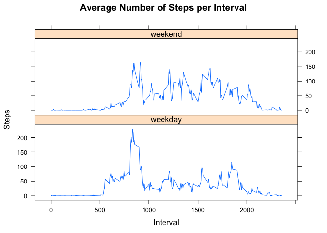

## Loading and preprocessing the data

```r
data <- read.csv("activity.csv")
data$date <- as.Date(data$date, "%Y-%m-%d")
```


## What is mean total number of steps taken per day?

```r
stepsByDay <- aggregate(steps ~ date, data, sum)
hist(stepsByDay$steps, main = paste("Total Steps Taken Each Day"), xlab="Number of Steps")
```

<!-- -->

```r
meanStep <- mean(stepsByDay$steps)
medianStep <- median(stepsByDay$steps)
```

The mean of the total number of steps taken per day is 10766.19 and the medain is 10765.

## What is the average daily activity pattern?

```r
stepsByInt <- aggregate(steps ~ interval, data, mean)
plot(stepsByInt$interval, stepsByInt$steps, type = "l",xlab="Interval", ylab="Number of             Steps", main="Average Number of Steps per Interval")
```

<!-- -->

```r
maxInt <- stepsByInt$interval[which.max(stepsByInt$steps)]
```

The interval with the maximum number of steps is 835.

## Imputing missing values

```r
totNAval <- sum(is.na(data$steps))
```

The strategy for filling in the missing values, is to replace the missing values with the mean value for the  5 minute interval. The mean value is also rounded to the next smaller integer, since number of step is an integer.


```r
newdata <- data
newdata$steps <- replace(data$steps, is.na(data$steps), floor(stepsByInt$steps))
```

The histogram of the new dataset is shown below:


```r
stepsByDay2 <- aggregate(steps ~ date, newdata, sum)
hist(stepsByDay2$steps, main = paste("Total Steps Taken Each Day"), xlab="Number of Steps")
```

<!-- -->

```r
meanStep2 <- mean(stepsByDay2$steps)
medianStep2 <- median(stepsByDay2$steps)
```
The new mean of the total number of steps taken per day is 10749.77 and the new medain is 10641.


```r
meandiff <- meanStep - meanStep2
mediandiff <- medianStep - medianStep2
```

The differese in mean value is 16.41819 and in the median value is 124. Hence the mean and median values are larger for the original dataset with missing values.

When imputing missing data the mean and median decreased, this is due to the rounding part. Without the rounding of the mean value, the mean for both the datasets would have bean the same. But if the  mean value is not rounded, non integer steps are allowed.

One can also see in the two histograms that the frequency in the interval between 10000 and 15000 steps increases for the dataset without missing values.

## Are there differences in activity patterns between weekdays and weekends?

```r
# English names on weekdays
Sys.setlocale("LC_TIME", "en_US")

weekend <- c("Sat", "Sun")
newdata$weekpart <-factor( weekdays(newdata$date, abbr = TRUE) %in% weekend, labels=c("weekday", "weekend"))

stepByWeek <- aggregate(steps ~ interval + weekpart, newdata, mean)
library(lattice)
```

```
## Warning: package 'lattice' was built under R version 3.3.2
```

```r
xyplot(stepByWeek$steps ~ stepByWeek$interval|stepByWeek$weekpart, main="Average Number of Steps per Interval",xlab="Interval", ylab="Steps",layout=c(1,2), type="l")
```

<!-- -->
